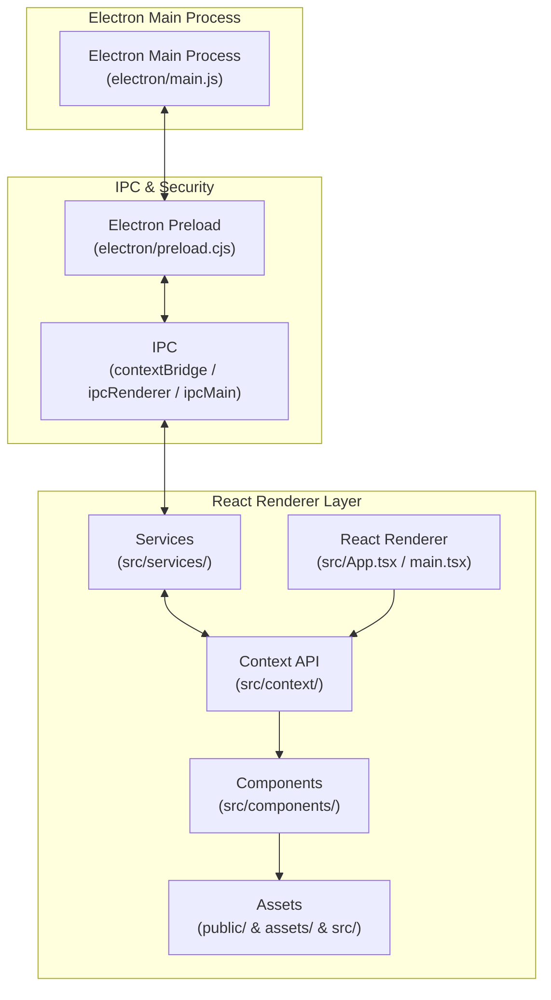

# Luper — Windows Performans Standartları

Luper, Windows işletim sisteminizin gizli potansiyelini ortaya çıkaran, oyuncular ve profesyoneller için geliştirilmiş yeni nesil bir optimizasyon ve performans platformudur.

Gecikmeleri en aza indirir, arka plan sistem yüklerini ortadan kaldırır ve donanımınızın tam güçte çalışmasını sağlar.

---

## 📋 Table of Contents

- [Öne Çıkan Özellikler](#-öne-çıkan-özellikler)
- [Hızlı Başlangıç](#️-hızlı-başlangıç)
- [Project Architecture](#project-architecture)
- [Technology Stack](#technology-stack)
- [Project Documentation](#project-documentation)
- [Mimari & Yönetişim Dokümanları](#-mimari--yönetişim-dokümanları)
- [İletişim & Geri Bildirim](#-iletişim--geri-bildirim)

---

## 🚀 Öne Çıkan Özellikler

- **Sysinternals Autoruns Seviyesinde Başlangıç Yöneticisi:** Windows `Run`, `StartupApproved` ve `AutorunsDisabled` karantina dizinlerini derinlemesine tarayarak sistem açılışını hızlandırır.
- **Bellek İçi (In-Memory) PowerShell Motoru:** Geçici `.ps1` dosyaları oluşturmadan, antivirüs / AMSI gecikmesi olmadan Base64 ve `stdin` akışı üzerinden sıfır disk gecikmeli komut yürütme.
- **Tek UAC Onaylı Toplu Optimizasyon:** Çoklu optimizasyonları tek bir paket halinde birleştirip tek bir Yönetici İzni penceresi ile milisaniyeler içinde uygulama.
- **Ağ & İnternet Kararlılığı:** Tepki sürelerini ve paket kaybını düşürerek kararlı ve düşük gecikmeli bir bağlantı sağlar.
- **İşlemci & Depolama Yönetimi:** Çekirdek verimliliğini maksimuma çıkarır, disk erişim hızlarını ve SSD sağlığını korur.
- **Gerçek Zamanlı Telemetri:** Windows 10/11 Build (26100 24H2/25H2) tespiti ve canlı CPU/RAM kullanım takibi.
- **Apple Sadeliğinde Arayüz:** Göz yormayan koyu temalı, Safir Mavi (`#1a5efd`) vurgulu, %100 Türkçe (`latin-ext` + UTF-8) akıcı ve sezgisel kullanım deneyimi.

---

## 🛠️ Hızlı Başlangıç

**Gereksinimler:**
- Node.js v20+
- Windows Yönetici (Administrator) İzni

Geliştirici ortamında çalıştırmak için:

```bash
npm install
npm run dev
```

(Test ortamı ve mock verilerle çalıştırmak için: `VITE_USE_MOCKS=true npm run dev`)

Uygulamayı başlatmak için:

```bash
npm start
```

Windows Electron installer derlemesi almak için:

```bash
npm run build
npm run dist
```

---

## Project Architecture



### Top-Level Project Structure

| Directory | Purpose |
| :--- | :--- |
| `.github` | CI/CD iş akışları, issue şablonları, CODEOWNERS ve GitHub yapılandırma dosyaları. |
| `RULES` | Proje mimarisi, AI ajan rol yönetimi, kodlama, güvenlik, tasarım ve yönetişim kuralları. |
| `assets` | Proje görsel öğeleri, AI Studio varlıkları ve medya kaynakları. |
| `dist` | Production derlemesi sonucu oluşturulan static frontend web çıktıları (HTML, JS, CSS). |
| `docs` | Mimari karar kayıtları (ADR), teknik dokümanlar ve proje kılavuzları. |
| `electron` | Electron Main Process (`main.js`) ve Electron Preload (`preload.cjs`) dosyaları (Win32 API & IPC köprüsü). |
| `node_modules` | Projenin bağımlı olduğu NPM paketleri ve kütüphaneler. |
| `public` | Statik varlıklar (logolar, ikonlar, fontlar ve doğrudan sunulan dosyalar). |
| `src` | React 19 / TypeScript kullanıcı arayüzü kaynak kodları (bileşenler, servisler, context, hooks). |

---

## Technology Stack

| Technology | Category / Version | Purpose / Description |
| :--- | :--- | :--- |
| **Electron** | Desktop Framework (`v43.1.1`) | Masaüstü pencere yönetimi, Win32 API ve PowerShell süreç yürütme motoru. |
| **React** | UI Framework (`v19.0.1`) | Bileşen tabanlı bildirimsel kullanıcı arayüzü ve state yönetimi. |
| **React DOM** | UI Renderer (`v19.0.1`) | React bileşenlerinin DOM render katmanında sunulması. |
| **TypeScript** | Language (`v5.8.2`) | Statik tip güvenliği (`strict: true`) ve kod kalitesi standartları. |
| **Vite** | Build Tool (`v6.2.3`) | Yüksek hızlı HMR geliştirme sunucusu ve frontend derleme. |
| **Tailwind CSS** | Styling (`v4.1.14`) | Modern atomik CSS stillendirme ve Luper Safir Mavi tasarım sistemi. |
| **Framer Motion (`motion`)** | Animation (`v12.23.24`) | Akıcı mikro-etkileşimler, sayfa ve bileşen animasyonları. |
| **Lucide React** | Icon Library (`v0.546.0`) | Modern UI simge ve ikon kütüphanesi. |
| **Node.js** | Runtime Environment | Yerel dosya sistemi erişimi, IPC süreçleri ve sistem servisleri entegrasyonu. |
| **Win32 API & PowerShell** | Windows Engine | Windows Kayıt Defteri (Registry), Autoruns, servis ve depolama optimizasyonları. |
| **Firebase** | Cloud Platform (`v12.16.0`) | Firestore ve bulut servisleri senkronizasyon altyapısı. |
| **Express** | Local API (`v4.21.2`) | Yerel HTTP dinleyici ve mikro-servis sunucu katmanı. |
| **Google GenAI SDK** | AI Integration (`v2.4.0`) | Geliştirme ortamı için `@google/genai` kütüphanesi entegrasyonu. |
| **Electron Builder** | Packaging (`v26.15.3`) | Windows installer (NSIS) derleme ve paketleme aracı. |
| **Electron Updater** | Auto Update (`v6.8.9`) | İstemci otomatik güncelleme altyapısı. |
| **Dotenv** | Configuration (`v17.2.3`) | `.env` dosyasından çevre değişkenleri yönetimi. |
| **ESBuild / TSX** | Tooling | Yüksek hızlı JS/TS dönüştürme ve TypeScript betik çalıştırıcısı. |

---

## Project Documentation

| Document / Directory | Description | Link |
| :--- | :--- | :--- |
| **AGENTS.md** | Master AI Rule System & Governance Entry Point | [AGENTS.md](AGENTS.md) |
| **RULES/** | Shared System Standards & Modular Agent Specs | [RULES/](RULES/AGENTS.md) |
| **docs/** | System & Architecture Documentation Directory | [docs/](docs/README.md) |
| **docs/adr/** | Architecture Decision Records (ADR Index) | [docs/adr/](docs/adr/README.md) |
| **.github/CODEOWNERS** | Code Ownership Matrix & Team Responsibilities | [.github/CODEOWNERS](.github/CODEOWNERS) |

---

## 📚 Mimari & Yönetişim Dokümanları

- 📜 [AGENTS.md](AGENTS.md) — Master AI Yönetişim Anayasası ve Orkestrasyon Kuralları
- 📂 [RULES/](RULES/AGENTS.md) — Modüler Sistem, Kodlama, Güvenlik ve Tasarım Standartları
- 📑 [ADR Dokümanı](docs/adr/ADR-0001-electron-architecture.md) — Mimari Karar Kayıtları

---

## 💬 İletişim & Geri Bildirim

Her türlü öneri ve geri bildiriminiz için uygulama içerisindeki iletişim kanallarını kullanabilirsiniz.
