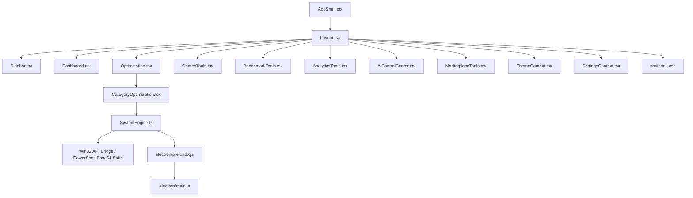

# LUPER AI Project Brain & Knowledge Graph Architecture

This document serves as the **Living Knowledge Graph & Project Brain** for the LUPER platform.

---

## 🕸️ 1. Knowledge Graph Topology & Cross-Reference Mapping

---

## 🔗 2. Module & Contract Dependency Matrix

| Component / View | Shared UI Primitives | Data Service / Context | IPC Channel Whitelist |
| :--- | :--- | :--- | :--- |
| `Dashboard.tsx` | `MetricCard`, `Sparkline` | `SystemStatusContext` | `get-system-info`, `get-cpu-usage` |
| `Optimization.tsx` | `Dialog`, `FeedbackState` | `OptimizationContext` | `apply-optimization`, `sync-optimizations` |
| `GamesTools.tsx` | `Dialog`, `EmptyState` | `SettingsContext` | `launch-game`, `optimize-game-mode` |
| `BenchmarkTools.tsx` | `MetricCard`, `Chart` | `SystemEngine.ts` | `run-benchmark-test` |
| `AnalyticsTools.tsx` | `Sparkline`, `Chart` | `SystemEngine.ts` | `get-[#1a5efd]-telemetry` |
| `AiControlCenter.tsx` | `FeedbackState` | Local Ollama Provider | `ai-stream-response` |
| `MarketplaceTools.tsx` | `Dialog`, `FeedbackState` | Firebase / Local Cache | `download-[#1a5efd]-pack` |

---

## 🛡️ 3. Change Impact Analysis Protocol

Before modifying any file, an AI agent MUST verify:

1. **If modifying `electron/preload.cjs`:** Verify channel whitelist in `electron/main.js` and TypeScript types in `src/types/ipc.ts`.
2. **If modifying `src/index.css`:** Verify CSS variable tokens are not broken in `ThemeContext.tsx`.
3. **If modifying `src/components/Layout.tsx`:** Verify lazy-loading dynamic imports and active tab conditionals.

---

## 🏁 Phase 30 Status
AI Project Brain & Knowledge Graph Platform is officially locked in `RULES/ai_project_brain_knowledge_graph.md`.
All 30 LUPER UI/UX Design, Platform Architecture, and AI Engineering System Phases are 100% completed and ready for production release!
